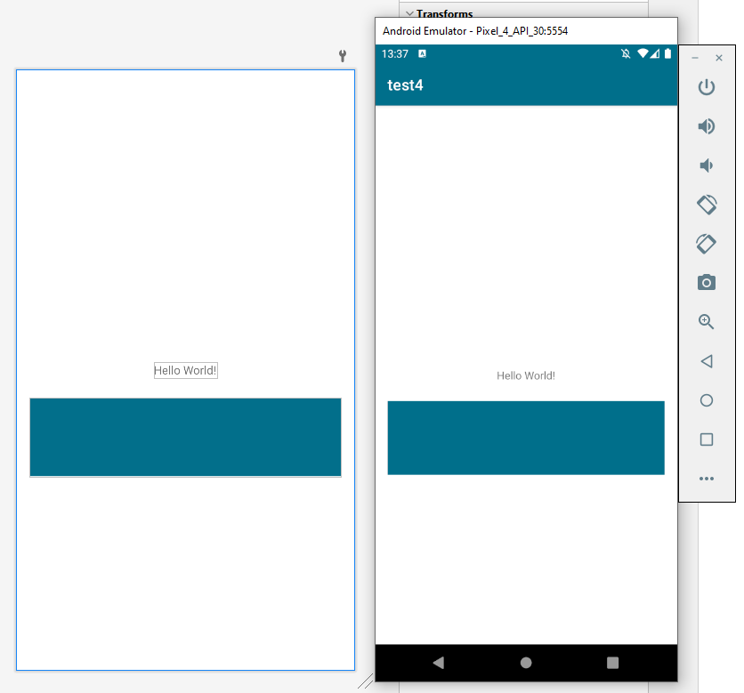

# android-color-problem

This demo app should show how a color of `#FF026F8B` becomes different once deployed to a device (`#FF006F8B`).
The following screenshot is showing the preview in the layout editor inside of Android Studio on the left and the app running in the emulator on the right.

One can use a color picker to verify that the color has changed.
This happens on a real device as well as on any device I'v tested.
Using jetpack compose or setting the color of some view programmatically, the same error occures.
It's not bound to some XML weirdness.
